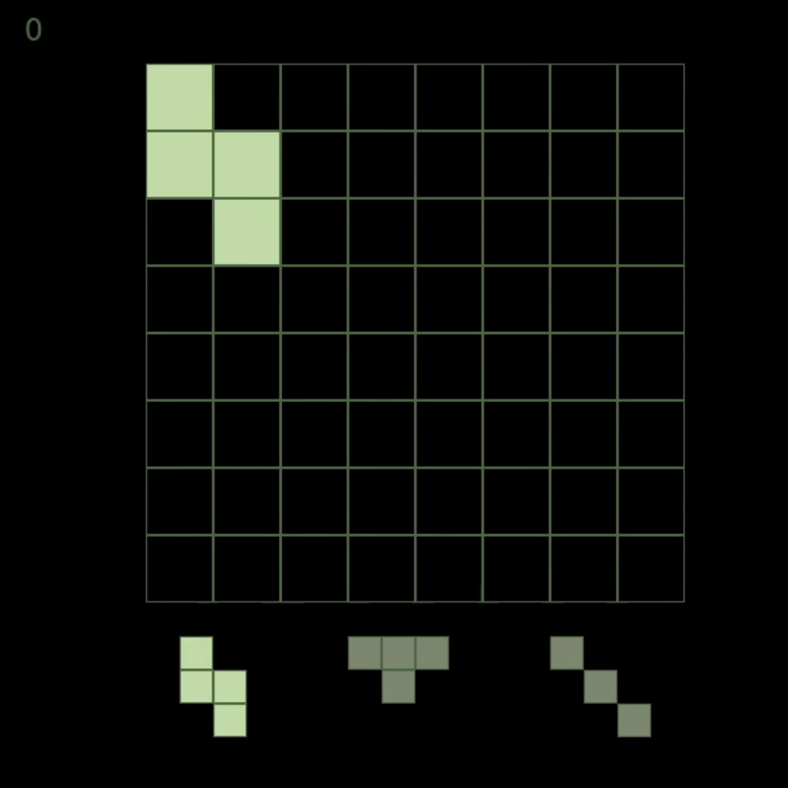

# ByteBlast

A [BlockBlast](https://play.google.com/store/apps/details?id=com.block.juggle&pcampaignid=web_share) clone using **pygame**. It includes an auto solver that uses a backtracking algorithm to find solutions.

BlockBlast is a puzzle game where players place blocks on a grid to clear rows and columns much like Tetris.

<p align="center">
    </img>
</p>

## Features

- **Block movement and placement**: Use the keyboard keys to move and place blocks on the grid.
- **Line clear**: Clear entire rows and columns when they are filled.
- **Random solvable block generation**: The game generates new blocks that can always be solved.
- **Score tracking**: Track your score as you place blocks and clear lines.
- **Auto-solve**: An algorithm that automatically solves the puzzle indefinitely using backtracking.

## Installation

1. Clone the repository:
    ```bash
    git clone https://github.com/andrianllmm/byteblast.git
    cd byteblast
    ```

2. Create and activate a virtual environment:
    ```bash
    python -m venv venv

    # Linux/macOS
    source venv/bin/activate
    # Windows
    venv\Scripts\activate
    ```

3. Install the dependencies:
    ```bash
    pip install -r requirements.txt
    ```

4. Start the game:
    ```bash
    python src/main.py
    ```